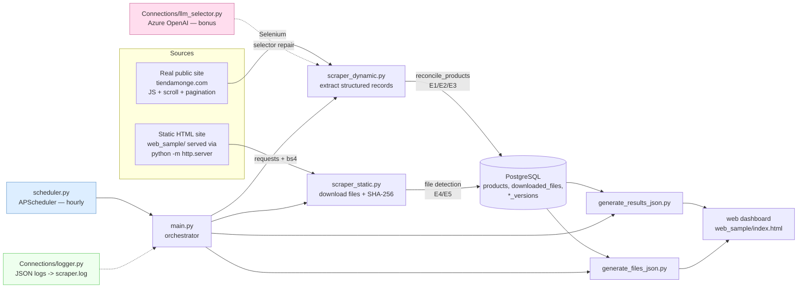

# VoiceFlip Technical Challenge — Web Scraping & Automation

> This is the application‑level readme. It mirrors the repo‑root
> [`../README.md`](../README.md) (the canonical copy); both are kept in sync.

A dynamic scraping system that extracts structured data from a real public
website, downloads files from a locally‑served static site, persists everything
in **PostgreSQL**, **detects changes** (new / modified / deleted records and
files), runs **hourly**, and emits **structured JSON logs**.

> **TL;DR — prove it works in one command** (after [setup](#-setup-local-without-docker)):
> ```bash
> cd TechChallengeVF
> python demo_change_detection.py
> ```
> It runs two passes against a self‑served copy of the static site and asserts
> all five change‑detection rules (E1–E5) fire. Expected: `ALL 11 CHECKS PASSED ✓`.

---

## 🏗 Architecture



Plain‑text view:

```
 Real site (Selenium) ─┐                          ┌─> results.json ─┐
                       ├─> PostgreSQL (+versions) ─┤                 ├─> dashboard
 Static site (requests)┘     ^   change detection  └─> files.json  ──┘
                             │   E1..E5 + JSON alerts
        main.py orchestrates · scheduler.py runs it hourly · logger.py = JSON logs
```

See [`docs/architecture.md`](docs/architecture.md) for detail.

---

## ✅ Requirements compliance

| # | Requirement | Where |
|---|-------------|-------|
| A | Scrape real public site w/ scroll + pagination | `scraper_dynamic.py` (`do_scroll`, `click_next_page`) |
| A | Structured fields (title, price, date, url, image) | `extract_products`; `products` table; real `first_seen` date |
| B | Static site mounted locally; files editable to test detection | `web_sample/` + `web_sample/files/` (local fixtures); `python -m http.server` |
| C | Download files + SHA‑256 hashing | `scraper_static.py` (`hash_bytes`, `downloads/`) |
| D | PostgreSQL persistence + version management | `Connections/database.py`; `file_versions` / `product_versions` |
| E1 | New record → insert + alert | `reconcile_products` → `[NEW][RECORD]` |
| E2 | Modified record → update + alert | `reconcile_products` → `[CHANGED][RECORD]` |
| E3 | Deleted record → remove from DB (+ files) | `reconcile_products` → `[DELETED][RECORD]` |
| E4 | File content changed (hash differs) → replace | `scraper_static._process_file` → `[CHANGED][FILE]` |
| E5 | File removed from source → delete locally | `scraper_static` deletion sweep → `[DELETED][FILE]` |
| F | Hourly automation | `scheduler.py` (APScheduler) — cron / `func start` documented below |
| G | JSON structured logs + resilient errors | `Connections/logger.py`; guarded stages |
| Test | Script demonstrating data + file change detection | `demo_change_detection.py` |
| Docs | README + env vars + architecture diagram | this file + `docs/` |
| Bonus | LLM generates/adapts CSS/XPath selectors | `Connections/llm_selector.py` (Azure OpenAI) |

---

## 📁 Project structure

```
TechChallengeVF/                  (repo root)
├── README.md                     # canonical readme
├── requirements.txt              # pinned dependencies
└── TechChallengeVF/              # application
    ├── ReadMe.md                 # this file (mirror of ../README.md)
    ├── main.py                   # full pipeline orchestrator (resilient)
    ├── scheduler.py              # APScheduler hourly automation
    ├── scraper_dynamic.py        # Selenium scraper (real site) + E1/E2/E3
    ├── scraper_static.py         # static-site file scraper + E4/E5
    ├── demo_change_detection.py  # ⭐ offline test proving E1–E5
    ├── generate_results_json.py  # products  -> data/results.json
    ├── generate_files_json.py    # files     -> data/files.json
    ├── json_api_server.py        # optional Flask API (port 5001)
    ├── Connections/
    │   ├── config.py             # central paths + env config
    │   ├── database.py           # Postgres + change-detection logic
    │   ├── logger.py             # structured JSON logging
    │   ├── llm_selector.py       # bonus: Azure OpenAI selector generator
    │   └── pruebaLLM.py          # bonus: public OpenAI interactive variant
    ├── web_sample/               # provided static site (+ local files/ fixtures)
    ├── docs/
    │   ├── architecture.md
    │   ├── Selenium.txt          # justification for Selenium
    │   ├── db_credentials.txt.example
    │   └── db_credentials.txt    # (gitignored — you create this)
    └── .env.example              # copy to .env (gitignored)
```

---

## 🐳 Run with Docker (no local Python/Postgres needed)

The whole stack — PostgreSQL **and** the app (with Chromium for Selenium) — runs
in containers. From the repo root:

```bash
docker compose build
docker compose run --rm app                  # runs the E1–E5 demo (default)
docker compose run --rm app python main.py   # full pipeline
docker compose up scheduler                  # hourly automation (profile: automation)
```

The `db` service is Postgres 16 (db `tienda`, user/pass `postgres`/`postgres`),
exposed on host port **5544** so it never collides with a local Postgres on
5432/5433. The app connects to it automatically via `PGHOST=db`. Expected demo
output: `ALL 11 CHECKS PASSED ✓`.

---

## 🔧 Setup (local, without Docker)

### Prerequisites
- **Python 3.9+** (developed/verified on 3.13)
- **PostgreSQL** running locally
- **Google Chrome** (for the Selenium dynamic scraper)

### 1. Create the virtual environment & install deps
```bash
python -m venv .venv
# Windows:
.\.venv\Scripts\activate
# Linux/macOS:
source .venv/bin/activate

pip install -r requirements.txt
```

### 2. Create the database
```bash
psql -U postgres -c "CREATE DATABASE tienda;"
```

### 3. Configure credentials (either option works)

**Option A — credentials file** (what the challenge asks for). Create
`docs/db_credentials.txt` from the template, 5 lines:
```
tienda
postgres
your_password
localhost
5432
```

**Option B — environment variables** (take precedence). Copy
`.env.example` to `.env` and fill it in.

### Environment variables

| Variable | Default | Purpose |
|----------|---------|---------|
| `PGDATABASE` / `PGUSER` / `PGPASSWORD` / `PGHOST` / `PGPORT` | from `db_credentials.txt` | PostgreSQL connection |
| `STATIC_BASE_URL` | `http://localhost:8000/` | where the static site is served |
| `API_PORT` | `5001` | Flask API port (`json_api_server.py`) |
| `AZURE_OPENAI_API_KEY` | _unset_ | bonus LLM selector generation (key is in the challenge PDF) |
| `AZURE_OPENAI_ENDPOINT` / `_DEPLOYMENT` / `_API_VERSION` | VoiceFlip defaults | Azure OpenAI config |
| `OPENAI_API_KEY` | _unset_ | only for the public‑OpenAI variant (`pruebaLLM.py`) |

Secrets (`.env`, `docs/db_credentials.txt`) are gitignored.

---

## ▶️ Running

All commands run from inside the `TechChallengeVF/` application folder with the
venv active.

### Prove change detection (recommended first run — the testing deliverable)
```bash
cd TechChallengeVF
python demo_change_detection.py
```
Self‑contained: it serves the static site on an ephemeral port, runs a baseline,
mutates products + files, re‑runs, and asserts E1–E5. **No external network.**

### Serve the static site (for the real static scraper / dashboard)
```bash
cd TechChallengeVF/web_sample
python -m http.server 8000
```
Then edit / replace / delete files under `web_sample/files/` (and
`web_sample/data/files.json`) between runs to trigger E4 / E5 manually.

### Full pipeline (dynamic + static + exports + LLM demo)
```bash
cd TechChallengeVF
python main.py
```
> The dynamic scraper hits the live Tienda Monge site (network + Chrome). If the
> site is unreachable or its markup changed, the run logs a warning and the LLM
> selector‑repair fallback proposes fresh selectors — it never crashes the pipeline.

### Individual pieces
```bash
python scraper_static.py     # static file scrape only (needs the http.server above)
python scraper_dynamic.py    # dynamic scrape only
python json_api_server.py    # optional Flask API on :5001
python Connections/pruebaLLM.py   # interactive LLM selector generator
```

---

## ⏱ Automation (run every hour)

### APScheduler (implemented)
```bash
cd TechChallengeVF
python scheduler.py
```
Runs the full pipeline once at startup, then every hour. A single coalesced job,
an error listener, and per‑run guards mean one failure never kills the scheduler.

### cron (alternative)
```cron
0 * * * * cd /path/to/TechChallengeVF/TechChallengeVF && /path/to/.venv/bin/python main.py >> cron.log 2>&1
```

### Simulated Azure Function — `func start` (alternative)
Wrap `run_scraping_full()` in a timer‑triggered function and run the Core Tools
host locally:
```jsonc
// function.json
{ "bindings": [ { "name": "timer", "type": "timerTrigger",
  "direction": "in", "schedule": "0 0 * * * *" } ] }
```
```python
# __init__.py
import azure.functions as func
from main import run_scraping_full
def main(timer: func.TimerRequest) -> None:
    run_scraping_full()
```
```bash
func start
```

---

## 🧠 Change‑detection design

- **Records** are keyed by a natural `product_key` (URL, else title) with a
  `content_hash` over `title|price|image_url|url`. Each run reconciles the
  scraped set against the DB: missing → INSERT (`[NEW]`), hash differs →
  UPDATE + history row (`[CHANGED]`), no longer present → DELETE (`[DELETED]`).
  The delete sweep is **skipped when 0 records are scraped**, so a failed scrape
  can never wipe the table.
- **Files** are keyed by catalogue `filename` with a SHA‑256 hash. Changed hash
  → file replaced + version bumped (`file_versions`). Removed from the catalogue
  → deleted locally + DB row removed — but **only when the catalogue itself was
  fetched successfully**, so a transient network error can’t purge your data.

Every transition is a structured JSON log line (`[NEW]` / `[CHANGED]` /
`[DELETED]`) written to stdout and the rotating `scraper.log`.

---

## 🤖 Bonus — LLM selector generation
`Connections/llm_selector.py` uses Azure OpenAI (`gpt-4o-mini`) to generate clean
CSS/XPath selectors from an HTML fragment, and is wired as a fallback in
`scraper_dynamic.py`: if extraction returns 0 products (markup changed), it asks
the LLM for fresh selectors and logs the suggestion. Set `AZURE_OPENAI_API_KEY`
to enable it; without a key it degrades gracefully (logs a warning, returns "").

## 📚 Why Selenium (not Scrapy + Playwright)?
The target site renders products client‑side (Algolia/Magento) behind infinite
scroll + numbered pagination, which needs a real browser driving the live DOM.
For the purely static local site, `requests` + BeautifulSoup is used instead.
Full reasoning in [`docs/Selenium.txt`](docs/Selenium.txt).
